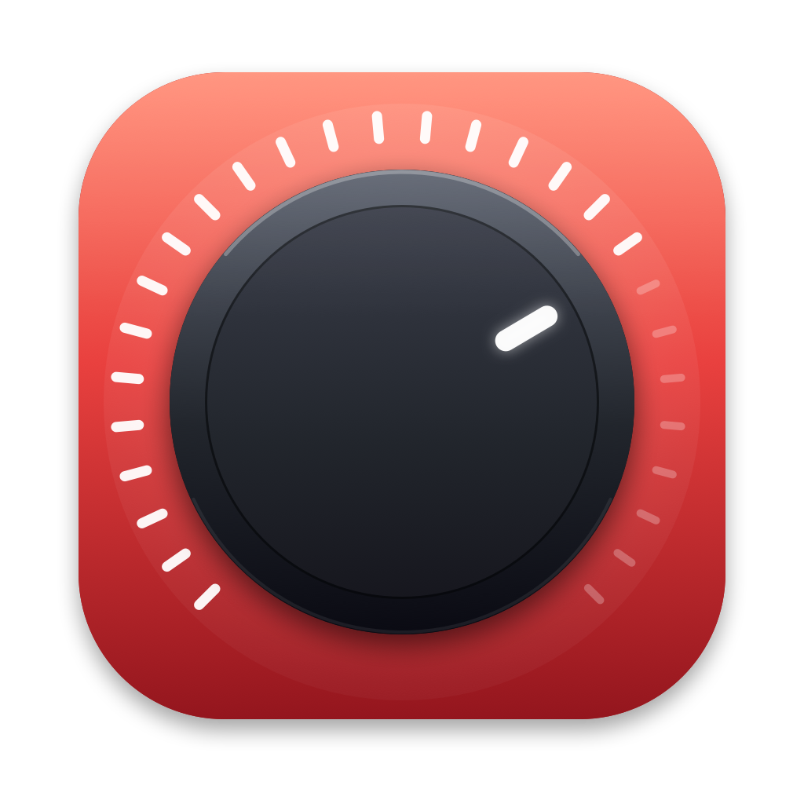

<p align="center"></p>

# Scarlett Volume

Utilitaire macOS pour contrôler le volume d'une interface audio sans volume
logiciel (Focusrite Scarlett 2i2 4th Gen, etc.) — alternative gratuite à
SoundSource pour ce cas d'usage. Touches de volume, HUD **natif** de macOS,
Centre de contrôle : tout affiche « Scarlett Volume ».

## Comment ça marche

macOS refuse de contrôler le volume de la Scarlett parce que l'interface
n'expose aucun contrôle de gain USB : le Mac lui envoie un signal brut à plein
volume.

Deux morceaux :

1. **`Scarlett Volume.driver`** — un build personnalisé de
   [BlackHole](https://github.com/ExistentialAudio/BlackHole) (GPL-3.0),
   renommé « Scarlett Volume » et compilé depuis `driver/BlackHole.c` par
   `build.sh`. C'est un périphérique de sortie virtuel qui expose un volume et
   une sourdine **natifs** (courbe −64 dB → 0 dB, appliquée au flux par le
   driver). macOS le voit comme une sortie standard : touches de volume, HUD
   système et Centre de contrôle fonctionnent nativement.
2. **`Scarlett Volume.app`** — l'app de barre de menus. Elle met le périphérique
   virtuel en sortie par défaut, crée un agrégat CoreAudio privé (virtuel +
   Scarlett, horloge sur la Scarlett, compensation de dérive) et recopie le flux
   vers la Scarlett en temps réel à gain 1 (bit-perfect : le volume est déjà
   appliqué par le driver). Elle persiste le volume entre les sessions, gère les
   branchements/débranchements et les changements de fréquence.

Le nom du périphérique — donc ce que macOS affiche partout — est « Scarlett
Volume » (UID `Scarlett Volume_UID`, défini dans `build.sh`).

## Installation

Le plus simple : télécharger le **.pkg** de la
[dernière release](https://github.com/nblavoie/scarlett-volume/releases) —
il installe l'app et le driver, redémarre le service audio et lance l'app.
(Non notarié : clic droit → Ouvrir si macOS le bloque.)

Depuis les sources :

```bash
./build.sh
cp -R "build/Scarlett Volume.app" /Applications/
open "/Applications/Scarlett Volume.app"
```

Pour produire l'installeur .pkg soi-même :

```bash
./package.sh 1.0.0   # → build/Scarlett-Volume-1.0.0.pkg
```

Le driver est embarqué dans l'app. Au lancement, s'il n'est pas installé (ou si
seul un vieux « BlackHole 2ch » est présent), l'app propose de l'installer :
invite de mot de passe macOS native, remplacement de l'ancien BlackHole le cas
échéant, redémarrage automatique de `coreaudiod` (le son coupe une ou deux
secondes), puis démarrage automatique du moteur.

Permission requise : **Microphone** — c'est l'étiquette générique de macOS pour
toute capture audio ; elle sert uniquement à relire le flux du périphérique
virtuel (l'audio système). Aucun micro physique n'est jamais ouvert, rien n'est
enregistré. Le point orange de capture reste affiché pendant que le moteur
tourne : c'est normal.

La permission Accessibilité n'est **plus nécessaire** : les touches de volume
sont gérées nativement par macOS. (L'app garde un mode secours — event tap +
HUD maison — si le périphérique virtuel détecté n'a pas de volume natif, p. ex.
un vieux BlackHole standard.)

Après un rebuild (`./build.sh`), la signature ad hoc change : macOS peut
redemander la permission micro.

## Utilisation

- **Touches volume +/− et sourdine** : natives, avec le HUD système habituel.
- **Centre de contrôle / Réglages → Son** : curseur actif, périphérique
  « Scarlett Volume ».
- **Icône barre de menus** : curseur (synchronisé avec le système), sourdine,
  redémarrage du moteur, ouverture à l'ouverture de session, quitter.
- En quittant, l'app remet la sortie système sur la Scarlett.
- Scarlett débranchée → bascule sur les haut-parleurs internes, reprise
  automatique au retour.
- Le bouton physique de la Scarlett continue de fonctionner (il agit en aval).

## Notes

- **Quitter SoundSource** : les deux se disputeraient la sortie par défaut.
- Si l'app plante ou est forcée à quitter, la sortie peut rester sur le
  périphérique virtuel (silence) : relancer l'app ou choisir la Scarlett dans
  Réglages → Son.
- L'ancien `BlackHole2ch.driver` installé par Homebrew est supprimé lors de
  l'installation du driver ; la fiche brew `blackhole-2ch` peut rester dans
  `brew list` — `brew uninstall --cask blackhole-2ch` pour nettoyer (sans
  conséquence sinon).
- Volume à 100 % = passage bit-perfect (gain unitaire dans le driver et dans la
  passerelle).

## Fichiers

- `main.swift` — l'app (~800 lignes)
- `driver/BlackHole.c` + `driver/Info.plist` — le driver virtuel (source
  BlackHole 0.7.x, GPL-3.0, © Existential Audio)
- `Info.plist` — LSUIElement (pas d'icône Dock), description micro
- `build.sh` — compile driver + app, embarque le driver dans l'app
- `package.sh` + `installer/` — construit l'installeur .pkg (app + driver +
  postinstall qui redémarre coreaudiod et lance l'app)
- `assets/make_icon.swift` — dessine l'icône en Core Graphics
  (`swift make_icon.swift` puis `iconutil` pour régénérer `AppIcon.icns`)

## Prérequis

- macOS 13+ (développé et testé sur macOS 26)
- Xcode Command Line Tools (`xcode-select --install`) pour `swiftc` et `clang`

## Licence

GPL-3.0 (voir `LICENSE`). Le driver virtuel est un build renommé de
[BlackHole](https://github.com/ExistentialAudio/BlackHole)
© [Existential Audio Inc.](https://existential.audio), distribué sous GPL-3.0 —
le code source du driver est inclus tel quel dans `driver/`, seules des
constantes de compilation (nom, UID, bundle ID) sont personnalisées via
`build.sh`. L'app de barre de menus (`main.swift`) est également sous GPL-3.0.
